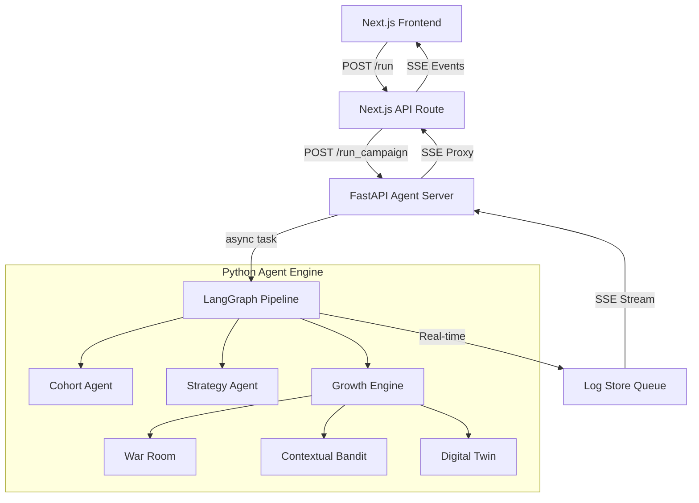

# Detailed Technical Report: Python Multi-Agent & Next.js Integration

## 1. Project Overview
This project successfully integrated a complex, multi-agent Python backend (powered by LangGraph and Gemini) into a modern TypeScript/Next.js frontend. The primary goal was to preserve the existing UI while significantly upgrading the campaign generation logic with advanced simulation, optimization, and segmentation agents.

## 2. System Architecture
The integration uses a **Synchronous Proxy / Asynchronous Pipeline** architecture.

### 2.1 Architectural Diagram


### 2.2 Key Components
- **`agents/server.py`**: FastAPI wrapper providing REST endpoints and SSE (Server-Sent Events) streaming.
- **`agents/pipeline.py`**: Orchestrator that manages background tasks and structured logging.
- **`agents/log_store.py`**: A thread-safe, in-memory queueing system (`asyncio.Queue`) that allows the background pipeline to communicate with the active HTTP stream.
- **`WebInterface/app/api/agent/run/route.ts`**: A Next.js route that translates Python SSE events into the frontend's expected format.

---

## 3. Implementation Deep Dive

### 3.1 Real-Time Progress Streaming (SSE)
One of the most complex challenges was ensuring the frontend terminal showed "agent thoughts" in real-time.

**The Solution: The Dual-Stream Proxy**
- When a campaign starts, the Python server immediately returns a `StreamingResponse`.
- A background task is spawned to run the LangGraph pipeline.
- As the graph reaches each node, it calls `emit_in_pipeline()`, which pushes a JSON log entry into an `asyncio.Queue`.
- The `StreamingResponse` generator continuously polls this queue and yields SSE chunks (`event: step`).
- **Critical Fix**: Initially, synchronous database calls (Supabase) blocked the Python event loop, causing logs to "burst" at the end. We solved this by ensuring all heavy LLM and API work is properly `await`ed, yielding control back to the streaming generator.

### 3.2 The Autonomous Growth Engine
The `ContentAgent` was upgraded from a static generator to a dynamic multi-agent "War Room":
1. **Contextual Bandit**: Selects the optimal psychological incentive (e.g., "Urgency", "Social Proof") based on the customer's tier (Diamond, Gold, etc.).
2. **War Room**: A LLM-driven debate where a Copywriter and Behavioral Psychologist collaborate to draft the variant.
3. **Digital Twin**: Generates 5 synthetic personas and simulates their reaction to the draft.
4. **Bayesian Kill-Rule**: If the Digital Twin predicts low engagement, the variant is rejected and regenerated (up to 3 times).

### 3.3 Data Integration
- **Supabase**: Used for persisting the final campaign, variants, and target customer IDs.
- **External CRM API**: Python agents sync real-time customer data using `httpx` to ensure the most current audience profile is used for segmentation.

---

## 4. Challenges & Resolutions

### 4.1 Event-Loop Blocking
- **Problem**: Python's `supabase-py` and `requests` are synchronous by default. Running them inside an `async def` function stops all other tasks (including log streaming).
- **Resolution**: We transitioned to `httpx.AsyncClient` for API calls and ensured that log emission happens *during* graph execution by passing the `session_id` into the LangGraph state.

### 4.2 Module Loading & Environment
- **Problem**: API Keys were required at import time, causing the server to crash on startup if `.env` wasn't loaded yet.
- **Resolution**: Implemented **Lazy Loading** for all LLM wrappers (`ChatGoogleGenerativeAI`). The models are now instantiated inside the nodes only when the task begins.

---

## 5. Deployment & Execution
The system is deployed on the **`agent`** branch of the `CampaignX` repository.

### Running the Backend
```bash
cd agents
pip install -r requirements.txt
python -m uvicorn agents.server:app --port 8000 --reload
```

### Running the Frontend
```bash
cd WebInterface
npm install
npm run dev
```

## 6. Conclusion
The integration successfully bridges the gap between high-speed web interfaces and complex AI reasoning. By implementing a custom, non-blocking SSE pipeline, we provided the user with a "Window into the Agent's Mind," showing every decision from the Contextual Bandit to the Digital Twin's simulation.

---
*Technical Documentation - March 2026*
