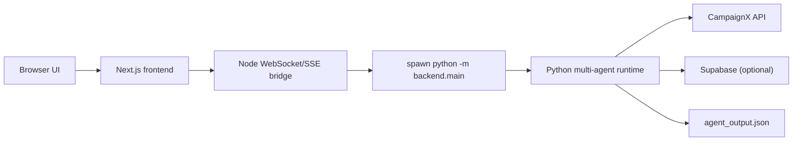

# AutoReach AI — README

AutoReach AI is a polished Next.js + Python multi-agent campaign orchestration project that combines a Human-in-the-Loop UI with a powerful Python agent swarm for segmentation, copy generation, simulation, and optimization. The frontend handles user interactions and bootstraps the agent process; the backend runs LangGraph/ReAct-style orchestration and optionally persists traces and results to Supabase.

This README is organized so you can quickly get started, understand the runtime architecture, and dive deep into the agent workflow and data flow.

--

**Quick links**

- Architecture narrative: [architecture_story.md](architecture_story.md)
- Backend deep design: [backend/ARCHITECTURE.md](backend/ARCHITECTURE.md)
- Supabase schema: [info/schema_to_run.sql](info/schema_to_run.sql)

--

**Badges & Quick Status**

- Node: 20+  •  Python: 3.10+  •  Next.js 14
- Dev flow: `next dev` + dev WebSocket bridge (port 3001)  •  Prod: `frontend/server.mjs` (single port)

--

## Eye-catching TL;DR Quickstart

PowerShell (Windows):

```powershell
Copy-Item .env.example .env
.\run.ps1
```

macOS / Linux:

```bash
cp .env.example .env
./run.sh
```

Manual (condensed):

```bash
python -m pip install -r backend/requirements.txt
cd frontend && npm install
cd frontend && npm run dev
# open http://localhost:3000
```

Docker quick run:

```bash
docker build -t autoreach-ai .
docker run --env-file .env -p 3000:3000 autoreach-ai
```

--

## High-level Architecture (visual)



Notes:

- Dev: `frontend/pages/api/agent/ws.ts` starts a standalone WS service (port 3001) and Node spawns Python for live runs.
- Prod: `frontend/server.mjs` serves HTTP + WS on the same port (default 3000).

--

## Detailed Agent Workflow (end-to-end)

The system is designed as a closed-loop multi-round campaign engine with HITL checkpoints. Below is the canonical flow the Python orchestrator (`backend/main.py`) runs when invoked by the UI.

1) Intake & Boot

- UI sends brief via agent stream.
- Node ensures a WS/SSE bridge and spawns `python -m backend.main` with environment variables.

2) Cohort Fetch & Merge

- `cohort_agent.py` calls CampaignX to fetch cohort (typically up to ~5k records) and optionally merges Supabase CRM enrichment.
- Records normalize to `CustomerRecord` with standardized fields: `age`, `income`, `city`, `occupation`, `app_installed`, etc.

3) Data Profiling

- `segment_engine.py` runs `_build_field_profile` computing min/max/mean and top value distributions to prevent LLM hallucination when suggesting thresholds.

4) Segment Synthesis (Data-Aware)

- LLM receives field profiles + 3 sample records + campaign brief and returns 3–6 logical segments with precise rule blocks and tier assignment (`Diamond`,`Gold`,`Silver`,`Reactivate`).
- Each segment comes with a human-readable description and a machine-evaluable logic tree.

5) Strategy & Angle Selection

- `strategy_agent.py` creates a multi-tier targeting rationale and priorities.
- `bandit.py` (contextual bandit with Thompson Sampling) suggests psychological angles (Urgency, Curiosity, Social Proof, Authority) per segment.

6) War Room — Drafting & Bias Rewriting

- `war_room.py` orchestrates two agents: Copywriter (drafts subject/body templates) and Psychologist (rewrites to embed cognitive biases per target tier).

7) Digital Twin Simulation & Kill Rule

- `twin_simulator.py` generates 5 synthetic personas; each persona returns `<CLICK>`, `<OPEN_ONLY>`, or `<IGNORE>`.
- If synthetic click rate < 20% => kill and regenerate (up to configurable attempts).

8) Personalization & STO

- `personalization.py` resolves placeholders (`{name}`, `{city}`, `{occupation}`) and `main.py` applies Send-Time Optimization heuristics.

9) Dispatch

- `campaignx_api.py` sends batches (chunking as needed). The orchestrator tracks campaign IDs for each segment.

10) Metric Fetch & Analysis

- Metric fetcher polls CampaignX for EO/EC (`analysis_agent.py`). In sandbox/fallback mode it can synthesize stable metrics.
- Analysis agent computes performance metrics and updates the bandit reward state.

11) Retargeting & Optimization Rounds

- `strategist_agent.py` outputs JSON directives for subsequent rounds (e.g., shorter body, visual CTA). The orchestrator splits audiences (Hot/Warm/Cold) and repeats steps 6–10 until max rounds.

12) Persist & Summarize

- Final traces write to Supabase (if configured) and `agent_output.json` is exported for the Node side to read and display.

--

## Component Reference (files and purpose)

- `backend/main.py` — orchestrator CLI, ReAct loop, optimization rounds.
- `backend/graph.py` — LangGraph state graph definitions for deterministic pipelines.
- `backend/state.py` — typed state objects passed through the graph.
- `backend/cohort_agent.py` — CampaignX + Supabase cohort ingestion and normalization.
- `backend/segment_engine.py` — data-aware segmentation and rule evaluator.
- `backend/war_room.py` — copywriter + psychologist collaboration.
- `backend/twin_simulator.py` — digital twin simulation and kill rule.
- `backend/analysis_agent.py` — metric aggregation and fallback simulation.
- `backend/bandit.py` — Thompson Sampling contextual bandit implementation.
- `backend/personalization.py` — template resolution and snippet injection.
- `backend/campaignx_api.py` — HTTP client for CampaignX.
- `backend/supabase_client.py` — persistence helpers for Supabase.

Frontend highlights:

- `frontend/app/` — Next.js App Router pages and dashboard UX.
- `frontend/pages/api/agent/ws.ts` — dev-only WS bootstrap route (port 3001).
- `frontend/server.mjs` — production custom server (HTTP + WS on single port).
- `frontend/src/lib/agent-stream.ts` — browser-side stream client.

--

## Environment & Configuration (short)

Copy `.env.example` to `.env` and fill required keys. Minimum for live runs:

- `CAMPAIGNX_API_KEY` (required)
- `GEMINI_API_KEY` (required)

Optional for full features:

- `NEXT_PUBLIC_SUPABASE_URL`, `NEXT_PUBLIC_SUPABASE_ANON_KEY`, `SUPABASE_SERVICE_ROLE_KEY`

Set `PYTHON_BIN` if Python isn't on PATH.

--

## Running modes and useful commands

- Start frontend dev server (from repo root):

```bash
cd frontend
npm install
npm run dev
```

- Run only Python pipeline (CLI mode):

```bash
python -m backend.main --brief "Launch a deposit campaign targeting urban professionals"
```

- Build & run Docker (single container):

```bash
docker build -t autoreach-ai .
docker run --env-file .env -p 3000:3000 autoreach-ai
```

--

## Troubleshooting (quick)

- If Next.js can't spawn Python: ensure `PYTHON_BIN` is set or `python` on PATH.
- If Supabase calls fail: verify `NEXT_PUBLIC_SUPABASE_URL` and service role key.
- If CampaignX returns 429: the metric fetcher will synthesize stable fallback records; check API quota.

--

## Contributing & Next steps

- I can add a `CONTRIBUTING.md` with dev setup, a `RUNBOOK.md` for common failures, or expand the README with screenshots and sample `agent_output.json` examples. Tell me which you'd prefer and I'll add it.

---