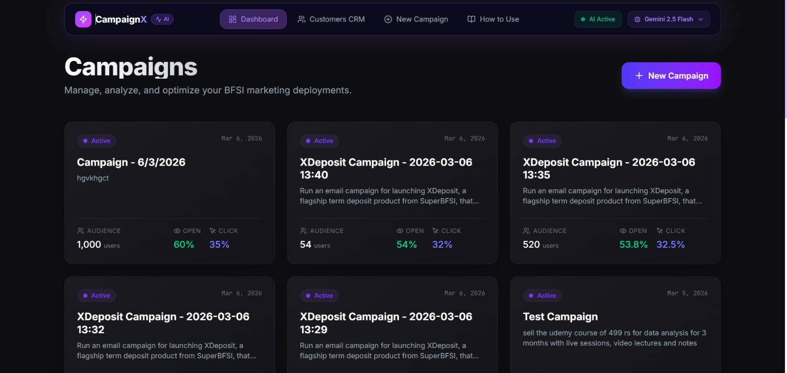
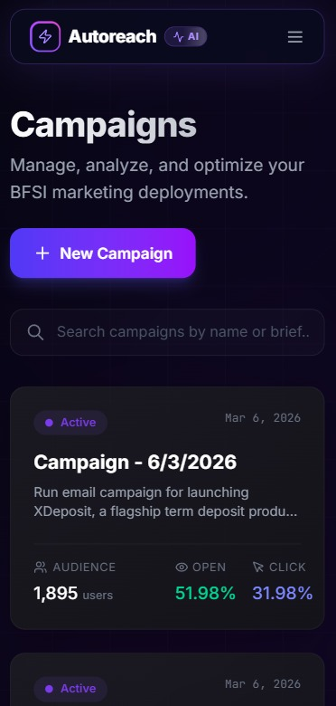
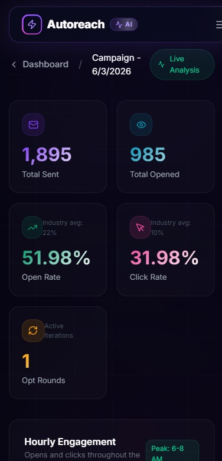
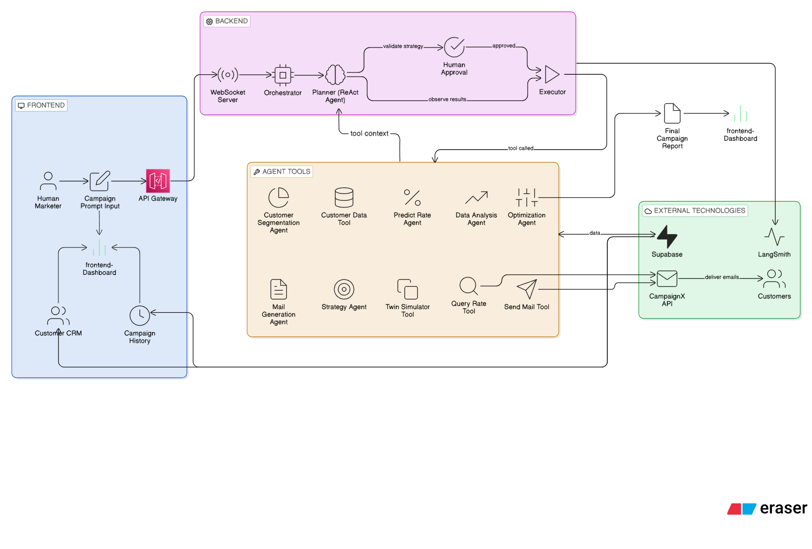
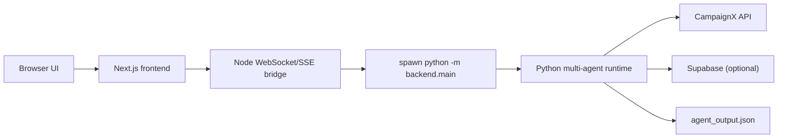
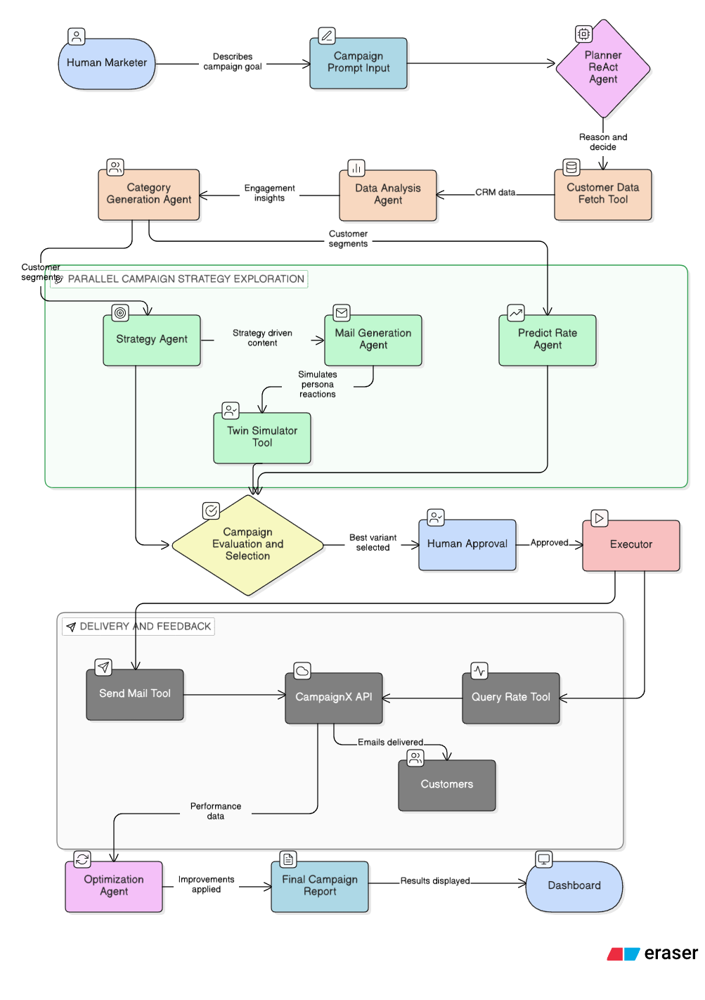

# AutoReach AI — README



AutoReach AI is a polished Next.js + Python multi-agent campaign orchestration project that combines a Human-in-the-Loop UI with a powerful Python agent swarm for segmentation, copy generation, simulation, and optimization. The frontend handles user interactions and bootstraps the agent process; the backend runs LangGraph/ReAct-style orchestration and optionally persists traces and results to Supabase.

<p align="center">
  
  &nbsp; &nbsp; &nbsp; &nbsp;
  
</p>

This README is organized so you can quickly get started, understand the runtime architecture, and dive deep into the agent workflow and data flow.

--

**Quick links**

- Architecture narrative: [architecture_story.md](architecture_story.md)
- Backend deep design: [backend/ARCHITECTURE.md](backend/ARCHITECTURE.md)
- Supabase schema: [info/schema_to_run.sql](info/schema_to_run.sql)
- System Workflow: [info/workflow.png](info/workflow.png)

--

**Badges & Quick Status**

- Node: 20+  •  Python: 3.10+  •  Next.js 14
- Dev flow: `next dev` + dev WebSocket bridge (port 3001)  •  Prod: `frontend/server.mjs` (single port)

--

## Project Folder Structure & Architecture

AutoReach AI is organized into highly modular folders, ensuring code is not hardcoded but layered into responsibilities.

### Idea of Each Folder

- **`frontend` (Next.js 14 & Node.js):**
  Provides the interactive UI, bridging the browser and the agent backends. It powers the Human-in-the-Loop dashboard where strategists can approve content and review live metrics.
- **`backend` (Python Orchestration):**
  Contains the core `main.py` orchestrator and LangGraph/ReAct planner loop. It is responsible for bridging Node/UI control signals to the Python agents.
- **`agents` (Python Cognitive Core):**
  This folder handles all the intelligence: segmentation, content drafting (War Room), simulation, and metrics evaluation. Breaking this out of `backend` isolates behavior generation from raw execution, maintaining professional-grade modularity.
- **`info` (Documentation & Resources):**
  Houses schemas, reference PDFs, rules, LaTeX files, and media (such as `architecture.png`, `workflow.png`, and UI jpegs) essential for understanding and presenting the project.

### High-level Architecture (visual)







--

## Short Installation Guide

AutoReach AI requires **Node v20+** and **Python 3.10+**. 

For the **full layout**, please refer to our **Installation Guide** (Latex source available in `install.txt`). 

Below is the quick summary:

**1. Set Environment Variables:**
```bash
cp .env.example .env
# Important: Fill CAMPAIGNX_API_KEY and GEMINI_API_KEY
```

**2. Fast Start (Windows/Linux):**
```bash
# Windows
.\run.ps1

# macOS/Linux
./run.sh
```

**3. Manual Step-by-Step:**
```bash
# Backend Dependencies
python -m pip install -r backend/requirements.txt

# Frontend & UI
cd frontend && npm install
npm run dev
```

--

## Detailed Agent Workflow (end-to-end)

The system is designed as a closed-loop multi-round campaign engine with HITL checkpoints. Below is the canonical flow the Python orchestrator runs:

1) **Intake & Boot:** UI sends brief via agent stream.
2) **Cohort Fetch & Merge:** `cohort_agent.py` fetches profiles from CampaignX.
3) **Data Profiling:** `segment_engine.py` runs deep profiling of the dataset.
4) **Segment Synthesis:** Dynamic semantic grouping of cohorts.
5) **Strategy & Angle Selection:** `strategy_agent.py` formulates engagement strategy via contextual bandit.
6) **War Room:** Dual agents (Copywriter & Psychologist) negotiate cognitive-biased drafts.
7) **Digital Twin Simulation:** AI simulacras predict clicks before sending.
8) **Personalization:** Snippet resolution.
9) **Dispatch:** Batched sending via `campaignx_api.py`.
10) **Metric Fetch:** `analysis_agent.py` pulls open/click data.
11) **Optimization Rounds:** Round-by-round optimization using heuristic feedback loops.

--

## Component Reference

- `backend/main.py` — orchestrator CLI, ReAct loop, optimization rounds. 
- `agents/state.py` — typed state objects passed through the graph.
- `agents/content_agent.py` — dynamically generates specific content.
- `agents/twin_simulator.py` — digital twin simulation and kill rule.

Frontend highlights:
- `frontend/app/` — Next.js App Router pages and dashboard UX.
- `frontend/server.mjs` — production custom server (HTTP + WS on single port).

--

## Troubleshooting (quick)

- If Next.js can't spawn Python: ensure `PYTHON_BIN` is set or `python` on PATH.
- If Supabase calls fail: verify `NEXT_PUBLIC_SUPABASE_URL` and service role key.
- If CampaignX returns 429: the metric fetcher will synthesize stable fallback records.

--

## Contributing & Next steps

I can add a `CONTRIBUTING.md` with dev setup, a `RUNBOOK.md` for common failures, or expand the README with screenshots and sample `agent_output.json` examples. Tell me which you'd prefer and I'll add it.
