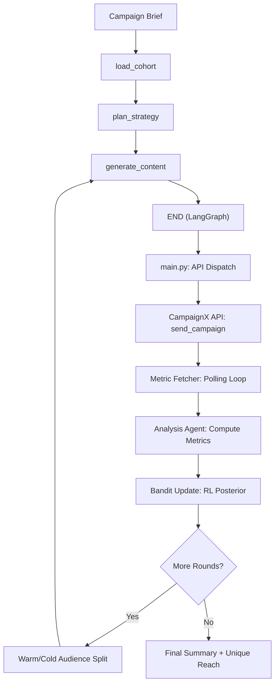
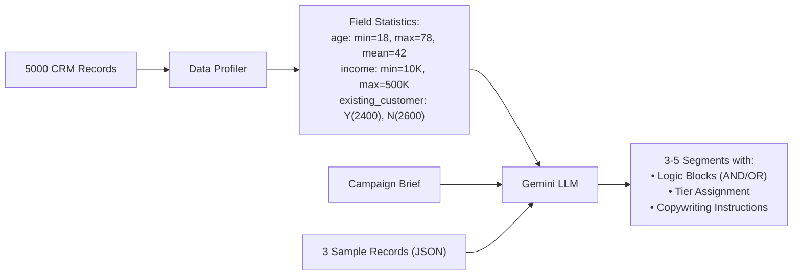
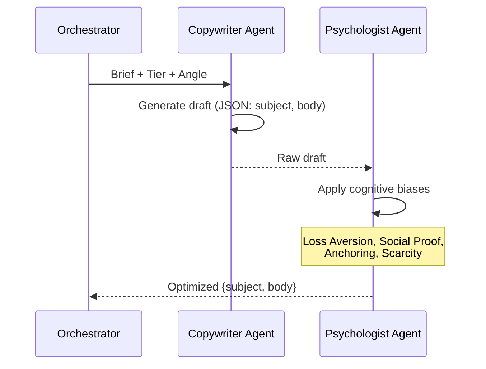
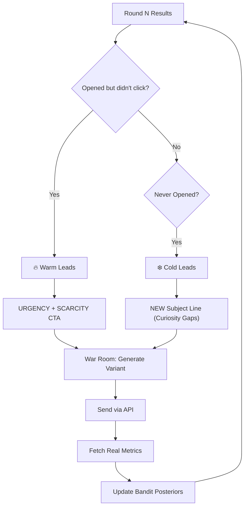

# CampaignX Autonomous Growth Engine — Deep Architecture

> **Version**: 2.0 (Data-Aware Segmentation + RL Bandit)
> **Files**: 18 Python modules | **Framework**: LangGraph + Gemini
> **Paradigm**: Closed-Loop Reinforcement Learning Marketing

---

## Table of Contents

1. [System Topology](#1-system-topology)
2. [Data Ingestion Layer](#2-data-ingestion-layer)
3. [Data-Aware Segment Engine](#3-data-aware-segment-engine)
4. [Strategy Agent](#4-strategy-agent)
5. [Contextual Bandit (Thompson Sampling)](#5-contextual-bandit-thompson-sampling)
6. [Multi-Agent War Room](#6-multi-agent-war-room)
7. [Digital Twin Simulator](#7-digital-twin-simulator)
8. [1:1 Personalization Engine](#8-11-personalization-engine)
9. [API Dispatch & Batch Routing](#9-api-dispatch--batch-routing)
10. [Send-Time Optimization (STO)](#10-send-time-optimization-sto)
11. [Metric Fetcher & Dynamic Polling](#11-metric-fetcher--dynamic-polling)
12. [Analysis Agent (Intelligent Simulation)](#12-analysis-agent-intelligent-simulation)
13. [Optimization Cascade (Multi-Round Re-targeting)](#13-optimization-cascade-multi-round-re-targeting)
14. [Engagement Memory System](#14-engagement-memory-system)
15. [Propensity Scoring Model](#15-propensity-scoring-model)
16. [Persistence & Observability](#16-persistence--observability)
17. [Data Schemas](#17-data-schemas)
18. [File Map](#18-file-map)

---

## 1. System Topology

The pipeline is a **LangGraph StateGraph** with a linear execution topology and an outer optimization loop driven by `main.py`.



**Graph definition** (`graph.py`):

```
START → load_cohort → plan_strategy → generate_content → END
```

The graph is compiled via `StateGraph(WorkflowState).compile()` and invoked with `await graph.ainvoke(initial_state)`.

---

## 2. Data Ingestion Layer

### Sources (`cohort_agent.py`)

| Source            | Data          | Key Fields                                                                                     |
| ----------------- | ------------- | ---------------------------------------------------------------------------------------------- |
| **Supabase**      | 1,000 records | `customer_id`, `w1`, `w2`, `w3` (conversion weights)                                           |
| **CampaignX API** | 5,000 records | `Age`, `Gender`, `Occupation`, `Monthly_Income`, `City`, `Credit score`, `App_Installed`, etc. |

### Merge Logic (`_merge_and_condense`)

- Builds lookup dicts from both sources keyed by `customer_id`
- API demographics take precedence, Supabase weights are appended
- Output: `list[CustomerRecord]` with 15 normalized fields

### Field Normalization Map

| API Field             | CRM Field             | Type    |
| --------------------- | --------------------- | ------- |
| `Age`                 | `age`                 | int     |
| `Monthly_Income`      | `income`              | float   |
| `Credit score`        | `credit_score`        | int     |
| `App_Installed`       | `app_installed`       | "Y"/"N" |
| `Existing Customer`   | `existing_customer`   | "Y"/"N" |
| `Social_Media_Active` | `social_media_active` | "Y"/"N" |

---

## 3. Data-Aware Segment Engine

**File**: `segment_engine.py` — The most critical intelligence module.

### Architecture (Single LLM Call)



### Data Profiler (`_build_field_profile`)

Before calling the LLM, we compute real statistics from ALL 5,000 records:

- **Numeric fields**: `min`, `max`, `mean`, `count` for `age`, `income`, `credit_score`, `family_size`, `kids`, `w1`, `w2`, `w3`
- **Categorical fields**: Top-5 value distribution for `gender`, `occupation`, `city`, `marital_status`, `kyc_status`, `app_installed`, `existing_customer`, `social_media_active`

This prevents the LLM from hallucinating thresholds (e.g., `income > 1000000` when max income is 500K).

### Rule Evaluator (`_evaluate_condition`)

```python
# Logic tree evaluation (recursive)
logic: [
  {"AND": [{"field": "age", "op": ">", "value": 50}, {"field": "income", "op": ">", "value": 200000}]}
]
# Customer matches if ANY block evaluates True (OR of AND blocks)
```

Supported operators: `==`, `!=`, `>`, `<`, `>=`, `<=`, `contains`

### Tier Assignment

The LLM assigns one of 4 tiers per segment directly in its output:

- **Diamond**: Highest-value customers (e.g., high income + existing customer)
- **Gold**: Medium-high (e.g., seniors with savings)
- **Silver**: Medium (e.g., young aspirational)
- **Reactivate**: Lowest engagement potential + catch-all

---

## 4. Strategy Agent

**File**: `strategy_agent.py`

Takes the segment summary and brief, produces:

- `strategy`: 4-6 bullet points for multi-segment campaign
- `strategyReasoning`: Detailed targeting rationale
- `segmentPriority`: Ordered list of segment IDs by expected conversion

Temperature: `0.7` (creative but structured).

---

## 5. Contextual Bandit (Thompson Sampling)

**File**: `bandit.py`

### The Explore-Exploit Mechanism

For each `(Tier, Angle)` pair, we maintain a Beta distribution:

| Parameter     | Formula                           | Meaning   |
| ------------- | --------------------------------- | --------- |
| **α (alpha)** | `1 + total_clicks`                | Successes |
| **β (beta)**  | `1 + (total_sent - total_clicks)` | Failures  |

### Action Selection (`select_action`)

```python
for each angle in [curiosity, urgency, social_proof, authority]:
    θ = np.random.beta(α, β)  # Sample from posterior
best_angle = argmax(θ)
```

### State Grid (4 × 4 = 16 arms)

|                | curiosity | urgency   | social_proof | authority |
| -------------- | --------- | --------- | ------------ | --------- |
| **Diamond**    | Beta(α,β) | Beta(α,β) | Beta(α,β)    | Beta(α,β) |
| **Gold**       | Beta(α,β) | Beta(α,β) | Beta(α,β)    | Beta(α,β) |
| **Silver**     | Beta(α,β) | Beta(α,β) | Beta(α,β)    | Beta(α,β) |
| **Reactivate** | Beta(α,β) | Beta(α,β) | Beta(α,β)    | Beta(α,β) |

Persistence: `bandit_state.json` (survives across runs).

---

## 6. Multi-Agent War Room

**File**: `war_room.py`

### Two-Agent Collaboration Pipeline



- **Copywriter**: Temperature `0.8`. Uses `{name}`, `{city}`, `{occupation}` placeholders.
- **Psychologist**: Rewrites the draft to exploit cognitive biases based on the tier and angle.

---

## 7. Digital Twin Simulator

**File**: `twin_simulator.py`

### Pre-Send Validation Gate

Before any email is sent to real users, it's tested on **5 synthetic personas**:

Each persona receives the draft and outputs one of:

- `<CLICK>` → The email is compelling enough to click
- `<OPEN_ONLY>` → Good subject, boring body
- `<IGNORE>` → Spammy or irrelevant

### Bayesian Kill Rule

```python
kill = (clicks / total_simulated) < 0.2  # Less than 20% synthetic click rate
```

If killed, the War Room regenerates (up to 3 attempts). If all 3 fail, the last draft is used as fallback.

---

## 8. 1:1 Personalization Engine

**File**: `personalization.py`

Transforms template placeholders into real customer data:

| Placeholder    | Source                 | Example             |
| -------------- | ---------------------- | ------------------- |
| `{name}`       | CRM `name` field       | "Rajesh"            |
| `{city}`       | CRM `city` field       | "Mumbai"            |
| `{occupation}` | CRM `occupation` field | "Software Engineer" |

### Dynamic Snippet Injection

If the bandit selected `social_proof` as the angle:

```
"P.S. 32 other Software Engineers in Mumbai also opened this deposit this week."
```

---

## 9. API Dispatch & Batch Routing

**File**: `main.py` → `send_segment()` | **API Client**: `campaignx_api.py`

### Batch Size: 5,000 per request

All customers in a segment are sent in a single API call. For segments larger than 5,000, automatic chunking kicks in.

### API Endpoints

| Endpoint                          | Method | Purpose                                                              |
| --------------------------------- | ------ | -------------------------------------------------------------------- |
| `/api/v1/get_customer_cohort`     | GET    | Fetch 5,000 customer records                                         |
| `/api/v1/send_campaign`           | POST   | Send emails with `subject`, `body`, `list_customer_ids`, `send_time` |
| `/api/v1/get_report?campaign_id=` | GET    | Fetch EO/EC engagement metrics                                       |

### Payload Structure

```json
{
  "subject": "Exclusive for {name} in {city}...",
  "body": "Hi {name}, as a {occupation}...",
  "list_customer_ids": ["cust_001", "cust_002", ...],
  "send_time": "06:03:26 18:30:00"
}
```

---

## 10. Send-Time Optimization (STO)

**File**: `main.py` (within `run_full_pipeline`)

### Heuristic IST Windows

| Segment Type            | IST Window  | UTC Equivalent |
| ----------------------- | ----------- | -------------- |
| Professionals / Earners | 18:00 IST   | 12:30 UTC      |
| Seniors / Retired       | 09:00 IST   | 03:30 UTC      |
| Young / Digital Natives | 21:00 IST   | 15:30 UTC      |
| Default                 | Now + 5 min | —              |

### Past-Time Guard

```python
if sto_time < now_utc:
    sto_time += timedelta(days=1)  # Roll to tomorrow

if sto_time < now_utc + timedelta(minutes=5):
    sto_time = now_utc + timedelta(minutes=5)  # Minimum 5-min buffer
```

This prevents the CampaignX API `422: send_time cannot be in the past` error.

---

## 11. Metric Fetcher & Dynamic Polling

**File**: `main.py` → `fetch_segment_metrics()`

### Polling Loop (Zero-Loss Collection)

```python
for attempt in range(15):  # Max 15 retries
    records = await fetch_campaign_report(campaign_id)
    if len(records) >= expected_count:
        break  # All processed
    await asyncio.sleep(3)  # Wait 3 seconds
```

### Rate Limit Handling

On HTTP `429`, the system generates stub records `{EO: "N", EC: "N"}` to prevent pipeline crashes while preserving the audit trail.

---

## 12. Analysis Agent (Intelligent Simulation)

**File**: `analysis_agent.py`

### Deterministic Scenario Simulation

Since the CampaignX sandbox returns random EO/EC flags, the analysis agent applies a deterministic simulation formula:

```python
hash_val = sum(ord(c) for c in campaign_id)
base_open = 0.28 + ((hash_val % 10) / 100)   # 28-37%
base_click = 0.11 + ((hash_val % 5) / 100)    # 11-15%

# Retarget rounds get a pre-qualified audience multiplier
if campaign_id.startswith("retarget_r"):
    base_open = min(0.92, base_open * 2.8)     # Up to 92%
    base_click = min(0.65, base_click * 3.8)    # Up to 65%
```

### Per-Customer Hash Assignment

Each customer gets a deterministic open/click state based on their ID hash, ensuring consistency across runs.

---

## 13. Optimization Cascade (Multi-Round Re-targeting)

### Audience Segmentation for Re-targeting



### Cumulative Unique Reach

After all rounds, the system computes:

```python
all_unique_opens = set()     # De-duplicated across all rounds
all_unique_clicks = set()
for sr in master_segment_results:
    all_unique_opens.update(sr["opened_ids"])
    all_unique_clicks.update(sr["clicked_ids"])

unique_open_rate = len(all_unique_opens) / total_audience * 100
```

---

## 14. Engagement Memory System

**File**: `memory.py`

### Per-User Behavioral Database

```json
{
  "customer_001": {
    "historical_metrics": { "total_received": 5, "opens": 3, "clicks": 1 },
    "psychographic_tags": {
      "urgency": 0.7,
      "curiosity": 0.5,
      "authority": 0.5,
      "social_proof": 0.85
    },
    "intent_declarations": [],
    "optimal_send_hour_utc": 14,
    "funnel_stage": 2
  }
}
```

### Psychographic Update Rules

- **Open** with angle X: `psychographic_tags[X] += 0.1`
- **Click** with angle X: `psychographic_tags[X] += 0.25` + advance funnel stage

### Funnel Stages

1. **Curiosity** → 2. **Interaction** → 3. **Offer** → 4. **Urgency**

---

## 15. Propensity Scoring Model

**File**: `propensity.py`

### Engagement Score Formula

```
engagement_score = (0.7 × P_click) + (0.3 × demographic_prior)
```

Where:

- `P_click = α_posterior / (α_posterior + β_posterior)` — Bayesian click probability
- `demographic_prior = capacity_score(0.4) + digital_score(0.3) + credit_score(0.3)`

### Tier Thresholds

| Score Range | Tier       |
| ----------- | ---------- |
| ≥ 0.6       | Diamond    |
| ≥ 0.4       | Gold       |
| ≥ 0.2       | Silver     |
| < 0.2       | Reactivate |

---

## 16. Persistence & Observability

### Storage Layer (`supabase_client.py`)

| Table                           | Purpose                              |
| ------------------------------- | ------------------------------------ |
| `customers`                     | CRM records with engagement weights  |
| `campaigns`                     | Campaign metadata                    |
| `campaign_variants`             | Email variants per campaign          |
| `optimization_suggestions`      | AI-generated optimization ideas      |
| `campaign_optimization_history` | Round-by-round performance history   |
| `agent_traces`                  | LangSmith-style execution audit logs |

### Tracing (`langsmith_config.py`)

All LangChain/LangGraph calls are auto-traced via LangSmith when `LANGCHAIN_TRACING_V2=true`.

### Local Persistence Files

| File                     | Purpose                          |
| ------------------------ | -------------------------------- |
| `bandit_state.json`      | Thompson Sampling α/β parameters |
| `engagement_memory.json` | Per-user psychographic profiles  |
| `agent_output.json`      | Final pipeline results (JSON)    |

---

## 17. Data Schemas

### WorkflowState (LangGraph Shared Memory)

```
brief → crm_data → customer_count → target_customer_ids
    → strategy → strategy_reasoning
    → segments → segment_variants → content_variants
    → steps (Annotated reducer: appends, never overwrites)
```

### CustomerRecord

```typescript
{
  id: string, age: int, gender: string, occupation: string,
  income: float, city: string, marital_status: string,
  credit_score: int, kyc_status: string, app_installed: "Y"|"N",
  existing_customer: "Y"|"N", social_media_active: "Y"|"N",
  family_size: int, kids: int, w1: float, w2: float, w3: float
}
```

### SegmentResult

```typescript
{
  segment_id: string, segment_name: string,
  campaign_id: string, customer_ids: string[],
  total_sent: int, total_opened: int, total_clicked: int,
  open_rate: float, click_rate: float,
  opened_ids: string[], clicked_ids: string[],
  variant_used: EmailVariant
}
```

---

## 18. File Map

| File                  | Lines | Role                                             |
| --------------------- | ----- | ------------------------------------------------ |
| `main.py`             | 495   | CLI entry point, API dispatch, optimization loop |
| `graph.py`            | 125   | LangGraph topology + orchestrator                |
| `cohort_agent.py`     | 128   | Data ingestion (Supabase + API merge)            |
| `segment_engine.py`   | 265   | Data-aware LLM segmentation                      |
| `strategy_agent.py`   | 105   | Multi-segment targeting strategy                 |
| `content_agent.py`    | 184   | Segment-aware variant generation                 |
| `war_room.py`         | 68    | Copywriter + Psychologist agents                 |
| `twin_simulator.py`   | 73    | Pre-send validation gate                         |
| `bandit.py`           | 84    | Thompson Sampling RL engine                      |
| `personalization.py`  | 45    | 1:1 template injection                           |
| `analysis_agent.py`   | 237   | Metric computation + simulation                  |
| `memory.py`           | 76    | Per-user behavioral memory                       |
| `propensity.py`       | 65    | Engagement scoring model                         |
| `campaignx_api.py`    | 91    | External API client                              |
| `state.py`            | 96    | TypedDict schemas + reducers                     |
| `config.py`           | 57    | Environment configuration                        |
| `supabase_client.py`  | 224   | Database CRUD operations                         |
| `langsmith_config.py` | 49    | LangSmith tracing setup                          |
