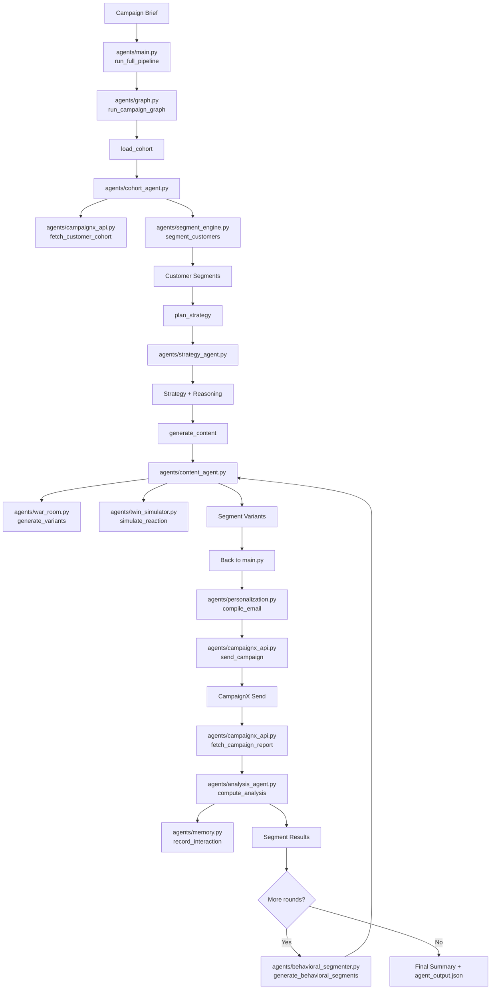
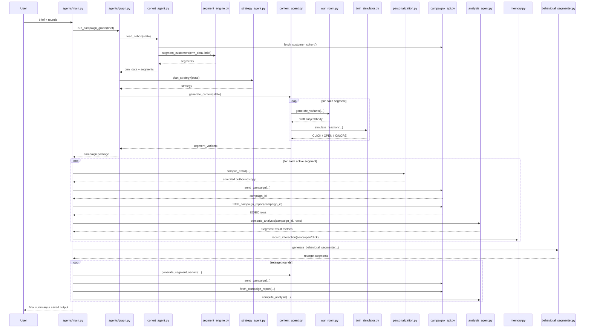

# Agents Folder Workflow Explanation

## 1. What the `agents` folder does

The `agents` package implements a marketing-campaign pipeline for CampaignX. It has two layers:

1. A LangGraph pipeline that creates the campaign.
2. A larger execution loop that sends campaigns, reads engagement reports, and creates re-targeting rounds.

The default runtime entry point is `agents/main.py`. That file calls the LangGraph orchestrator in `agents/graph.py`, then continues with sending, measurement, and optimization outside the graph.

In practical terms, the system solves the problem statement like this:

1. Read a campaign brief.
2. Fetch and normalize customer data.
3. Segment customers into meaningful groups.
4. Generate different email copy for each group.
5. Send those segment-specific emails through CampaignX.
6. Fetch engagement metrics from CampaignX.
7. Split users into behavioral follow-up groups.
8. Generate better follow-up emails and repeat for more rounds.

## 2. End-to-end execution flow

## 2A. Flow model

### High-level system flow

### Runtime sequence model

### Simplified control model

The architecture can be reduced to this control loop:

1. `Create`  
   `graph.py` runs `load_cohort -> plan_strategy -> generate_content`.

2. `Execute`  
   `main.py` compiles the chosen variant per segment and sends it through CampaignX.

3. `Measure`  
   `main.py` fetches reports and `analysis_agent.py` converts them into metrics.

4. `Learn`  
   `memory.py` stores engagement history and `behavioral_segmenter.py` creates follow-up audiences.

5. `Re-act`  
   `content_agent.py` generates improved re-targeting emails and the loop repeats.

### Step 0: Package import and environment setup

Before execution starts, imports pull in shared configuration and helpers:

- `agents/config.py`
  - Loads `.env`.
  - Exposes API keys, model names, Supabase settings, and CampaignX base URL.
- `agents/state.py`
  - Defines the shared data contracts used across the graph and runtime.
- `agents/__init__.py`
  - Marks the folder as a Python package.

This means most other files do not read environment variables directly. They read them through `config.py`.

### Step 1: CLI entry point in `agents/main.py`

The normal execution starts in:

- `parse_args()`
  - Reads the campaign brief and optional `--rounds`.
- `main()`
  - Calls `run_full_pipeline(brief, rounds)`.
  - Saves the final output to `agent_output.json`.

`run_full_pipeline()` is the true top-level controller. It is responsible for:

1. Running the initial LangGraph campaign creation flow.
2. Sending segment-specific campaigns.
3. Polling CampaignX for results.
4. Running behavioral re-targeting rounds.
5. Producing the final summary object.

### Step 2: LangGraph orchestration in `agents/graph.py`

`run_full_pipeline()` calls `run_campaign_graph()` from `agents/graph.py`.

That file builds a linear LangGraph:

`START -> load_cohort -> plan_strategy -> generate_content -> END`

The file has two main responsibilities:

- `build_graph()`
  - Registers the three nodes and edges.
- `run_campaign_graph(brief)`
  - Enables tracing through `langsmith_config.py`.
  - Creates the initial `WorkflowState`.
  - Invokes the graph asynchronously.
  - Persists a run trace through `supabase_client.persist_agent_trace()`.

So `graph.py` does not contain business logic itself. It wires the business logic nodes together.

### Step 3: Cohort loading in `agents/cohort_agent.py`

The first graph node is `load_cohort(state)`.

This file does three main things:

1. Fetches raw customer data from CampaignX with `_fetch_from_api()`.
2. Normalizes and condenses customer records with `_prepare_crm_data()`.
3. Passes the normalized cohort into the segmenter with `segment_customers()`.

Important details:

- `_fetch_from_api()` calls `agents/campaignx_api.py`.
- `_prepare_crm_data()` standardizes keys and computes:
  - `engagement_score` from historical send/open/click counts.
  - `propensity_score` from `w1`, `w2`, `w3`.
- It returns compact `CustomerRecord` objects that downstream agents can safely use.

This node writes the following into shared state:

- `crm_data`
- `customer_count`
- `target_customer_ids`
- `segments`
- one audit step in `steps`

### Step 4: External API access in `agents/campaignx_api.py` and `agents/campaignx_discovery.py`

`cohort_agent.py`, `main.py`, and `optimization_agent.py` all depend on `campaignx_api.py`.

#### `campaignx_api.py`

This is the HTTP wrapper around CampaignX:

- `fetch_customer_cohort()`
- `send_campaign()`
- `fetch_campaign_report()`

It uses `httpx` and applies the `X-API-Key` header from `config.py`.

#### `campaignx_discovery.py`

This file is an unusual but important support layer. Instead of hardcoding endpoints, it tries to discover them from local documentation:

- `CampaignX API v1.pdf`
- `README.md`

It exposes:

- `discover_campaignx_spec()`
- `resolve_campaignx_operation()`

So the actual request path is:

1. Caller asks for logical operation like `"cohort"` or `"send"`.
2. `campaignx_api.py` resolves that logical operation through `campaignx_discovery.py`.
3. `campaignx_api.py` sends the HTTP request.

### Step 5: Segmentation in `agents/segment_engine.py`

`cohort_agent.load_cohort()` calls `segment_customers(crm_data, brief)`.

This file provides the segmentation intelligence. The current implementation is:

1. Build a feature matrix from customer data.
2. Scale the features.
3. Run `KMeans` clustering.
4. Ask Gemini to interpret each cluster and give it a marketing label.

Key helper functions:

- `_build_feature_matrix()`
  - Converts demographics, weights, engagement, and binary flags into ML features.
- `_build_field_profile()`
  - Creates a statistical profile of each cluster for the LLM.
- `segment_customers()`
  - Runs clustering and returns `CustomerSegment` objects.
- `get_segment_profile()`
  - Builds a compact prompt-friendly profile used later by the content generator.

This file is where demographic targeting becomes concrete. It decides which users belong to which segment and what messaging posture each segment should receive.

### Step 6: Strategy generation in `agents/strategy_agent.py`

The second graph node is `plan_strategy(state)`.

It reads:

- campaign brief
- segments
- CRM count

It asks Gemini for:

- an overall multi-segment strategy
- reasoning
- segment priority ordering

Its output goes back into the shared state as:

- `strategy`
- `strategy_reasoning`
- another step in `steps`

Interaction-wise:

1. `graph.py` passes graph state into `plan_strategy()`.
2. `plan_strategy()` summarizes the segments.
3. Gemini generates strategic guidance.
4. The updated state is returned to the graph.

Note: this file contains the intended strategy-generation logic, but the current implementation falls back to a default strategy if parsing fails.

### Step 7: Content generation in `agents/content_agent.py`

The third graph node is `generate_content(state)`.

This file is the main content orchestration layer. It generates one email variant per segment.

The central function is:

- `generate_segment_variant(brief, strategy, segment)`

That function coordinates four ideas:

1. Build a segment-specific prompt from the brief and segment profile.
2. Pick a psychological angle using a lightweight epsilon-greedy bandit.
3. Generate copy through the War Room.
4. Test the draft through the Twin Simulator before accepting it.

#### Angle selection

`generate_segment_variant()` uses `memory_db` from `agents/memory.py`:

- Sometimes it explores a random angle.
- Otherwise it exploits the highest psychographic signal from past engagement history.

This is a reinforcement-style loop, even though it is implemented with simple heuristics instead of a separate bandit service.

#### War Room collaboration

`content_agent.py` calls `war_room.generate_variants()` from `agents/war_room.py`.

#### Draft validation

After War Room output:

- `personalization_engine.sanitize_campaign_copy()` removes unsafe placeholders and URL issues.
- `twin_engine.simulate_reaction()` from `agents/twin_simulator.py` tests the copy on synthetic personas.
- If the draft fails the simulator check, the content agent regenerates.

#### Final output of `generate_content()`

It returns:

- `content_variants`
- `segment_variants`
- an additional step in `steps`

This is the final output of the LangGraph phase.

### Step 8: Multi-agent copy generation in `agents/war_room.py`

`war_room.py` contains `WarRoom`, instantiated as the singleton `war_room`.

Its `generate_variants()` method runs a two-pass generation flow:

1. Copywriter pass
  - Writes the first draft using brief, tier, and psychological angle.
2. Psychologist pass
  - Rewrites the draft to improve persuasion and clarity.

The file expects JSON output with `subject` and `body`. If parsing fails, it returns a fallback email template.

This file contributes the actual persuasive wording for each segment.

### Step 9: Synthetic gating in `agents/twin_simulator.py`

`twin_simulator.py` contains `TwinSimulator`, exposed as `twin_engine`.

It has two active methods:

- `simulate_reaction(user, subject, body)`
- `bayesian_kill_rule(simulated_results)`

Execution role:

1. `content_agent.py` sends draft content to the twin simulator.
2. Gemini role-plays a skeptical customer.
3. The simulator outputs `CLICK`, `OPEN`, or `IGNORE`.
4. The kill rule rejects weak drafts.

This file acts as a pre-send quality gate before real API dispatch.

### Step 10: Returning from LangGraph to `agents/main.py`

Once `run_campaign_graph()` finishes, `main.py` receives:

- the normalized CRM data
- all demographic segments
- one chosen email variant for each segment
- strategy text
- accumulated audit steps

At this point the system leaves the graph and enters operational execution.

## 3. Post-graph operational workflow in `agents/main.py`

### Step 11: Segment dispatch

For each non-empty segment, `run_full_pipeline()` does three things:

1. Chooses a send time.
2. Calls `send_segment()`.
3. Stores the returned CampaignX campaign IDs.

#### `send_segment()`

This function:

- deduplicates customer IDs
- batches sends in groups of 1000
- calls `personalization_engine.compile_email()`
- posts the final payload through `campaignx_api.send_campaign()`

So the interaction chain is:

`main.py -> personalization.py -> campaignx_api.py -> CampaignX`

### Step 12: Personalization in `agents/personalization.py`

This file is not responsible for deciding the message. It is responsible for safely compiling that message into outbound content.

Main methods:

- `personalize_email()`
  - Resolves placeholders like `{{name}}`, `{{city}}`, `{{occupation}}`.
- `compile_email()`
  - For one recipient, does true personalization.
  - For multi-recipient batches, replaces placeholders with safe shared values or generic text.
- `sanitize_campaign_copy()`
  - Removes unsupported URLs.
  - Normalizes whitespace.
  - Deduplicates CTA URLs.
  - Enforces length limits.

This file is the final formatting/compliance layer before sending.

### Step 13: Report polling and metric calculation

After sends are done, `main.py` calls `fetch_segment_metrics()` for each segment.

This function:

1. Polls `campaignx_api.fetch_campaign_report()`.
2. Waits and retries until all rows arrive or retries are exhausted.
3. Falls back to stub `EO=N`, `EC=N` rows if rate limits prevent retrieval.
4. Calls `compute_analysis()` from `agents/analysis_agent.py`.
5. Updates `memory_db` in `agents/memory.py`.
6. Returns a `SegmentResult`.

#### `agents/analysis_agent.py`

The active part of this file in the default workflow is `compute_analysis()`.

It converts CampaignX report rows into:

- `total_sent`
- `total_opened`
- `total_clicked`
- open and click rates
- `opened_ids`
- `clicked_ids`
- warm and cold audience IDs

The file also contains `generate_optimization_suggestions()`, but `main.py` imports it without calling it in the current default flow.

### Step 14: Memory update in `agents/memory.py`

`main.py` records engagement events through the singleton `memory_db`.

`EngagementMemory` stores per-customer history in `engagement_memory.json`.

Important responsibilities:

- create default memory records for unseen users
- record `send`, `open`, and `click`
- update psychographic tags when an angle is known
- advance funnel stage on clicks
- persist the memory file on each change

This file is how earlier campaign outcomes influence later variant selection in `content_agent.py`.

## 4. Behavioral optimization loop

### Step 15: Behavioral re-segmentation in `agents/behavioral_segmenter.py`

After round 1 metrics are collected, `main.py` calls:

- `generate_behavioral_segments(previous_results, historical_results)`

This file converts demographic results into follow-up audiences such as:

- warm customers who opened but did not click
- cold customers who never opened

It also:

- suppresses customers who already clicked in prior rounds
- assigns a re-target stage
- assigns a priority score
- chooses a send window
- merges tiny segments into macro buckets

This is the bridge between measurement and optimization.

### Step 16: Re-target content generation

For each behavioral segment, `main.py` calls `content_agent.generate_segment_variant()` again.

This means the same content-generation stack is reused:

1. behavioral segment profile
2. angle choice from memory
3. War Room generation
4. Twin Simulator gating
5. sanitation and send

The difference is that the segment now contains behavior-specific instructions such as:

- `warm_convert`
- `warm_resolve`
- `cold_subject_refresh`
- `cold_benefit_reminder`

Those instructions change the copy guidance in `content_agent.py`.

### Step 17: Re-send and re-measure

For each behavioral segment, `main.py` then repeats:

1. `send_segment()`
2. `fetch_segment_metrics()`

The new `SegmentResult` objects are appended to `master_segment_results`.

At the end, `main.py` computes:

- round-by-round metrics
- cumulative unique opens
- cumulative unique clicks
- final output payload

Then `main()` writes the final JSON to `agent_output.json`.

## 5. Shared state and schemas

### `agents/state.py`

This file is the contract layer for the whole package.

It defines:

- `AgentStep`
- `EmailVariant`
- `CustomerRecord`
- `CustomerSegment`
- `SegmentResult`
- `WorkflowState`

It also defines `_merge_steps()`, which is used as a reducer for `WorkflowState.steps`.

That reducer matters because every graph node appends trace steps instead of overwriting earlier steps. So `steps` becomes the execution audit trail across the graph.

## 6. Observability and persistence support

### `agents/langsmith_config.py`

This file enables tracing for LangChain and LangGraph by setting environment variables at runtime.

It is called at the start of `run_campaign_graph()`.

### `agents/supabase_client.py`

This file contains CRUD helpers for:

- customers
- campaigns
- variants
- optimization suggestions
- optimization history
- agent traces

In the default `main.py` flow, the only clearly active usage is:

- `persist_agent_trace()` from `graph.py`

The rest of the Supabase functions support alternate or future flows.

## 7. Files present but not part of the default `main.py` execution path

These files matter to understanding the folder, but they are not in the standard path started by `python -m agents.main`.

### `agents/optimization_agent.py`

This is an alternate post-campaign optimization workflow that:

- loads a campaign from Supabase
- fetches its report
- asks Gemini for optimized targeting/content
- scores customers
- resends the campaign
- persists updated campaign and optimization history

It is a standalone optimization path, but `main.py` does not call it.

### `agents/weight_agent.py`

This file asks Gemini how to adjust customer topic weights (`w1`, `w2`, `w3`) based on campaign results.

It currently returns suggestions, but there is no active call into it from `main.py`.

### `agents/propensity.py`

This file defines a richer `PropensityModel` that combines demographics and memory history.

However, the current default workflow does not call it. Instead, `cohort_agent.py` computes a simpler direct `propensity_score`.

## 8. Documentation-only file

### `agents/ARCHITECTURE.md`

This is a human-readable architecture description of the folder. It helps explain the intended design, but it is not executed.

## 9. File interaction map

The active interaction chain is:

1. `main.py`
2. `graph.py`
3. `cohort_agent.py`
4. `campaignx_api.py`
5. `campaignx_discovery.py`
6. back to `cohort_agent.py`
7. `segment_engine.py`
8. `strategy_agent.py`
9. `content_agent.py`
10. `war_room.py`
11. `twin_simulator.py`
12. back to `content_agent.py`
13. back to `graph.py`
14. back to `main.py`
15. `personalization.py`
16. `campaignx_api.py` for sending
17. `campaignx_api.py` for report fetch
18. `analysis_agent.py`
19. `memory.py`
20. `behavioral_segmenter.py`
21. `content_agent.py` again for re-target rounds
22. repeat send/fetch/analyze until rounds finish

## 10. Concise file-by-file contribution summary

- `__init__.py`
  - Package marker.
- `config.py`
  - Centralized environment loading.
- `state.py`
  - Shared schemas for all nodes and runtime functions.
- `graph.py`
  - Builds and runs the LangGraph campaign-creation pipeline.
- `cohort_agent.py`
  - Fetches customer data, normalizes it, and triggers segmentation.
- `campaignx_api.py`
  - Sends HTTP requests to CampaignX.
- `campaignx_discovery.py`
  - Resolves endpoint paths from local documentation.
- `segment_engine.py`
  - Converts customer records into labeled marketing segments.
- `strategy_agent.py`
  - Produces segment-aware campaign strategy.
- `content_agent.py`
  - Generates the winning email variant for each segment.
- `war_room.py`
  - Produces persuasive copy using multi-role prompting.
- `twin_simulator.py`
  - Rejects weak drafts before sending.
- `personalization.py`
  - Compiles templates into safe outbound content.
- `analysis_agent.py`
  - Converts CampaignX report rows into usable engagement metrics.
- `memory.py`
  - Persists user interaction history and psychographic memory.
- `behavioral_segmenter.py`
  - Builds behavior-based re-targeting segments from prior results.
- `langsmith_config.py`
  - Enables tracing.
- `supabase_client.py`
  - Persists traces and supports campaign/history storage.
- `optimization_agent.py`
  - Alternate optimization flow, not used by `main.py`.
- `weight_agent.py`
  - Alternate weight-tuning helper, not used by `main.py`.
- `propensity.py`
  - Alternate scoring model, not used by the default flow.
- `ARCHITECTURE.md`
  - Architecture documentation, not executable.

## 11. Final mental model

The cleanest way to think about the `agents` folder is:

- `graph.py` handles campaign creation.
- `main.py` handles campaign execution and optimization.
- `state.py`, `config.py`, `campaignx_api.py`, `personalization.py`, and `memory.py` are shared infrastructure.
- `cohort_agent.py`, `segment_engine.py`, `strategy_agent.py`, and `content_agent.py` create the initial campaign.
- `analysis_agent.py` and `behavioral_segmenter.py` turn performance data into the next round of targeting.
- `war_room.py` and `twin_simulator.py` are the quality layer around copy generation.
- `optimization_agent.py`, `weight_agent.py`, and `propensity.py` are supporting or alternate paths that exist in the folder but are not part of the default runtime started by `main.py`.
